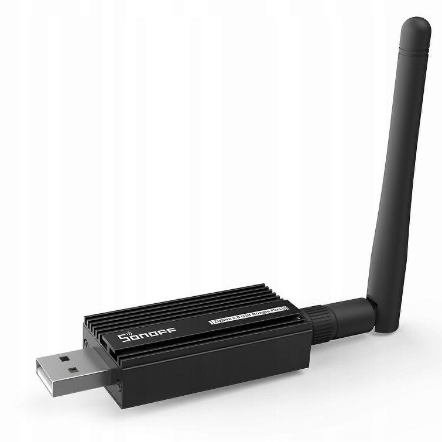
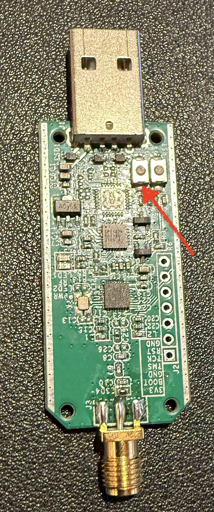
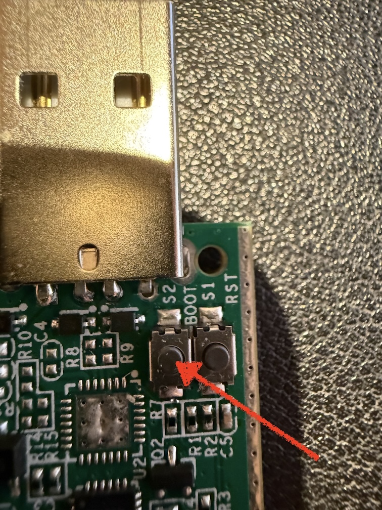
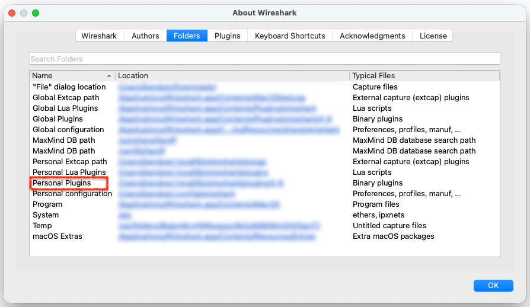
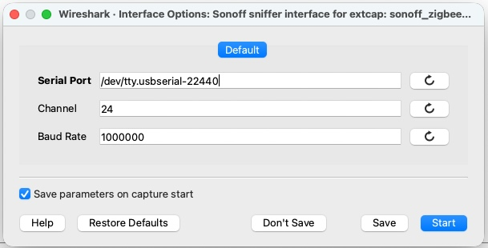
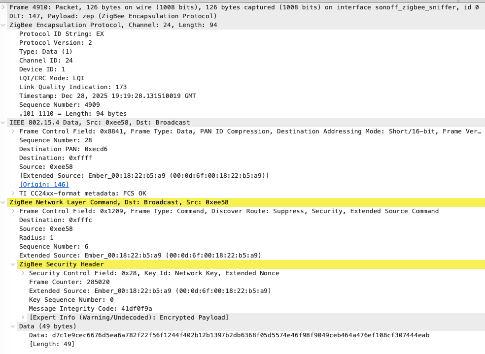

# zigbee-tools
A collection of Zigbee tools and experiments

This repository contains various tools and experiments related to capturing and processing Zigbee traffic.

### Sniffing Zigbee traffic with Wireshark

The hardware I used to sniff Zigbee traffic is the [SONOFF Zigbee 3.0 USB Dongle Plus | ZBDongle-E](https://sonoff.tech/en-uk/products/sonoff-zigbee-3-0-usb-dongle-plus-zbdongle-e). 




The dongle comes with pre-installed firmware for Zigbee coordinator functionality, and needs to be reflashed with  sniffer firmware to capture Zigbee traffic. 


### Flashing the dongle 
To flash the dongle with the sniffer firmware, I used the [universal-silabs-flasher](https://pypi.org/project/universal-silabs-flasher/) Python package. There is a [browser-based flasher](https://dongle.sonoff.tech/sonoff-dongle-flasher/) provided by Sonoff, but I wasn't able to get it to work with a custom firmware file.

1. From the command line, install the package:
   ```
   pip install universal-silabs-flasher
   ```
2. Download the sniffer firmware file `Sniffer_802.15.4_SONOFF_USB_Dongle_Plus_E.gbl` from [ErkSponge
Sniffer_802.15.4_SONOFF_USB_Dongle_Plus_E repository](https://github.com/ErkSponge/Sniffer_802.15.4_SONOFF_USB_Dongle_Plus_E/blob/main/Output/Sniffer_802.15.4_SONOFF_USB_Dongle_Plus_E/Sniffer_802.15.4_SONOFF_USB_Dongle_Plus_E.gbl). This repository is an excellent source of information and inspiration - thank you Eric St-Onge!
3. Plug the dongle to your computer's USB port and establish how it presents itself (e.g. `/dev/cu.usbserial-XXXX` on MacOS or `COMX` on Windows). I'm on MacOS, so I used the command `ls /dev/cu.*` before and after plugging in the dongle to identify the correct device path. 
4. Take off the dongle casing to access the boot button. Press and hold the boot button while plugging in the dongle to enter bootloader mode.




5. Flash the firmware using the following command (replace the device path with your own):
   ```
   universal-silabs-flasher --device /dev/cu.usbserial-22420 flash --firmware ~/Desktop/Sniffer_802.15.4_SONOFF_USB_Dongle_Plus_E.gbl --allow-cross-flashing  
   ```
6. After flashing, unplug and replug the dongle. It should now be ready to capture Zigbee traffic. You should see the LED on the dongle PCB blinking as it captures packets.

7. Check the dongle's serial port again (e.g. `ls /dev/tty.*` on MacOS) to see the new device name. You will need this for Wireshark configuration.

### Wireshark plug-in and configuration
To capture and analyze Zigbee traffic, Wireshark needs to be configured to work with the sniffer dongle. This is done by installing a custom Python plug-in and setting up the correct capture options.

I used Wireshark 4.6.2 for the capture, but other versions may work as well. Open Wireshark and follow these steps (tested on MacOS):

1. From the 'About' Wireshark menu, check the 'Folders' tab to locate the plugins directory.



2. Locate the Personal Plugins folder and click on the blue URL link to open it in Finder. 

3. From this repository, copy the `wireshark/sonoff-zbdongle-e-sniffer` file to your Personal Plugins folder. 

4. Make the file executable by running the following command in Terminal (replace the path with your own):
   ```
   chmod +x /path/to/sonoff-zbdongle-e-sniffer
   ```

5. Restart Wireshark to load the new plug-in which should now appear under the 'Capture Interfaces' menu.

Click on the settings icon to the left of the Sonoff sniffer interface to open the plug-in parameters window.



Set the desired channel capture (e.g. 15, 20, 25) and set the serial port to the one identified earlier (e.g. `/dev/tty.usbserial-XXXX`). Leave the baud rate at 1000000.

6. Start capturing in Wireshark on the Sonoff sniffer interface. You should start seeing Zigbee packets in Wireshark! 



If you know the network key, you can enter it in Wireshark to decrypt the traffic. Go to `Wireshark` -> `Preferences` -> `Protocols` -> `ZigBee` and enter the network key in the 'Pre-configured keys' section.
