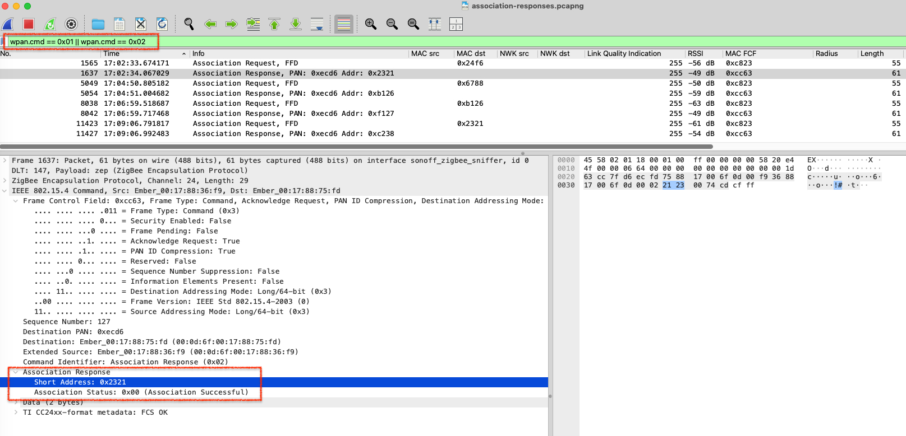

# Zigbee Mesh Network Visualizer

A real-time visualization tool for Zigbee mesh networks that captures and displays network topology, routing paths, and link quality metrics.

## Features

- **Real-time visualization** of Zigbee mesh network topology
- **Link Quality Indicator (LQI)** and RSSI metrics for each connection
- **Route tracking** showing multi-hop paths through the mesh
- **Interactive graph** with hub-centric layout
- **Configurable parameters** via command-line arguments
- **Logging** of all network activity to file

## Requirements

### Python Version
- Python 3.7 or higher

### Dependencies

Install the required Python packages:

```bash
pip install pyserial networkx matplotlib
```

Or install from a requirements file:

```bash
pip install -r requirements.txt
```

**Required libraries:**
- `pyserial` - Serial port communication with the Zigbee dongle
- `networkx` - Graph data structure and algorithms
- `matplotlib` - Network visualization and plotting

## Hardware Requirements

- Sonoff ZBDongle-E (or compatible Zigbee sniffer)
- USB connection to host computer

## Configuration

### Device Names

Edit the `DEVICE_NAMES` dictionary in `mesh_visualiser.py` to map your Zigbee device addresses to friendly names:

```python
DEVICE_NAMES = {
    '0x0000': 'Hub',
    '0xbeb2': 'Hallway',
    '0xc765': 'Utility',
    # ... add your devices
}
```

Tip: to get the device address, use the sniffer tool in the Wireshark folder to capture the packets as a device joins the network. The Zigbee assocation request/response packets can be found in the Wireshark capture using the filter:

```
wpan.cmd == 0x01 || wpan.cmd == 0x02
```
The asociated response will contain the device's allocated short address.



### Default Settings

You can modify the default constants at the top of the script:

```python
SERIAL_PORT     = "/dev/tty.usbserial-22440"    # Update with your serial port
SERIAL_BAUD     = 1000000                       # Baud rate for Sonoff ZBDongle-E   
SERIAL_CHANNEL  = 24                            # Default Zigbee channel
LOGFILE_PATH    = "~/Downloads/topology.txt"    # Log file path
UPDATE_INTERVAL = 2.0                           # Visualization update interval (seconds)
```

## Usage

### Basic Usage

Run with default settings:

```bash
python mesh_visualiser.py
```

### Command-Line Arguments

The visualizer supports the following command-line arguments:

```bash
python mesh_visualiser.py [OPTIONS]
```

**Options:**

- `-p, --port <PORT>` - Serial port (default: `/dev/tty.usbserial-22440`)
- `-b, --baud <RATE>` - Baud rate (default: `1000000`)
- `-c, --channel <CHANNEL>` - Zigbee channel number (default: `24`)
- `-l, --logfile <PATH>` - Log file path (default: `~/Downloads/topology.txt`)
- `-u, --update-interval <SECONDS>` - Visualization update interval (default: `2.0`)
- `-h, --help` - Show help message

### Examples

Monitor channel 25 with a 1-second update interval:

```bash
python mesh_visualiser.py -c 25 -u 1.0
```

Use a different serial port and log file:

```bash
python mesh_visualiser.py -p /dev/ttyUSB0 -l ~/logs/zigbee.log
```

Full custom configuration:

```bash
python mesh_visualiser.py \
  --port /dev/ttyUSB0 \
  --baud 1000000 \
  --channel 24 \
  --logfile ~/zigbee_mesh.log \
  --update-interval 1.5
```

## Finding Your Serial Port

### macOS
```bash
ls /dev/tty.usb*
```

### Linux
```bash
ls /dev/ttyUSB* /dev/ttyACM*
```

### Windows
Check Device Manager or use:
```
COM3, COM4, etc.
```

## Understanding the Visualization

### Graph Elements

- **Red squares** - Hub/coordinator devices
- **Blue circles** - End devices and routers
- **Arrows** - Message flow direction
- **Arrow thickness** - Message volume (thicker = more traffic)
- **Edge labels** - Link Quality Indicator (LQI) values

### Graph Title

The title displays:
- Current Zigbee channel
- Number of nodes in the network
- Number of connections
- Total messages captured

### Console Output

The tool prints real-time routing information:

```
[HH:MM:SS.mmm] LQI:xxx RSSI:xxxx Source -> Relay1 -> Relay2 -> Destination
```

## Stopping the Visualizer

Press `Ctrl+C` to stop capture. The final visualization will remain open for inspection.

## Troubleshooting

### Serial Port Permission Denied (Linux/macOS)

Add your user to the dialout group:

```bash
sudo usermod -a -G dialout $USER
```

Then log out and log back in.

### No Data Appearing

1. Verify the correct serial port is selected
2. Check that the Zigbee dongle is properly connected
3. Ensure you're monitoring the correct Zigbee channel
4. Verify the baud rate matches your dongle (1000000 for Sonoff ZBDongle-E)

### Import Errors

Ensure all dependencies are installed:

```bash
pip install --upgrade pyserial networkx matplotlib
```

## License

See the main repository LICENSE file for details.
